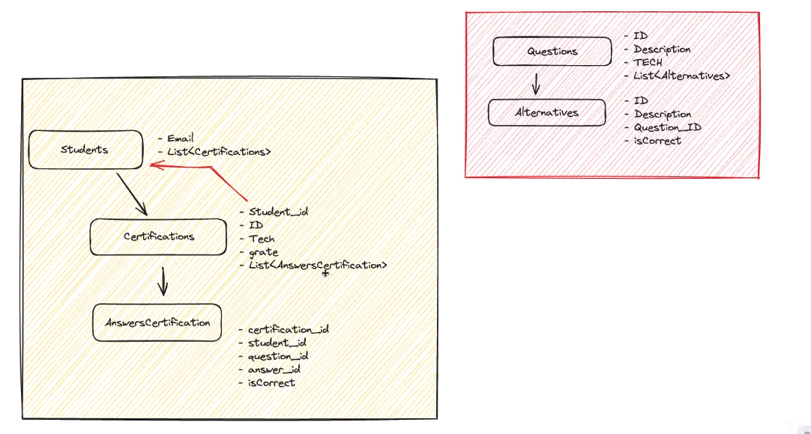

# Certification NLW Expert - Rocketseat

Projeto desenvolvido durante a trilha de `Java` do evento ["NLW Expert"](https://www.rocketseat.com.br/eventos/nlw) da [Rocketseat](https://www.rocketseat.com.br/?utm_source=google&utm_medium=cpc&utm_campaign=lead&utm_term=perpetuo&utm_content=institucional-lead-home-texto-lead-brandkws-none-none-institucional-none-none-br-google&utm_term=rocketseat&utm_campaign=PROGRAMAS-ALL-BRANDKWS-SEM&utm_source=adwords&utm_medium=cpc&hsa_acc=8545075154&hsa_cam=16048648686&hsa_grp=135825188594&hsa_ad=579096962131&hsa_src=g&hsa_tgt=kwd-679159515078&hsa_kw=rocketseat&hsa_mt=b&hsa_net=adwords&hsa_ver=3&gad_source=1&gclid=CjwKCAiAlJKuBhAdEiwAnZb7lVHXVxla2jmXhkKNB-M9M6zBYigOePI4qFxwj55dfBV5Y6pFGYMjWRoClckQAvD_BwE).

## Conteúdos abordados

- Java 17
- Spring Boot 3
- Maven
- Spring Data JPA
- Integração com PostgreSQL com Docker
- Criação de seeds para popular o banco de dados
- DTOs

## Entidades

